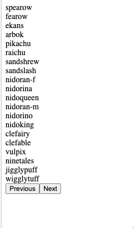

# Pokemon API call

A simple react app implemented with axios api call to https://pokeapi.co/api/v2/pokemon and display the list of pokemons

Developed buttons for pagination: click on previous and next to browse pokemons on other pages.

## Screenshots

